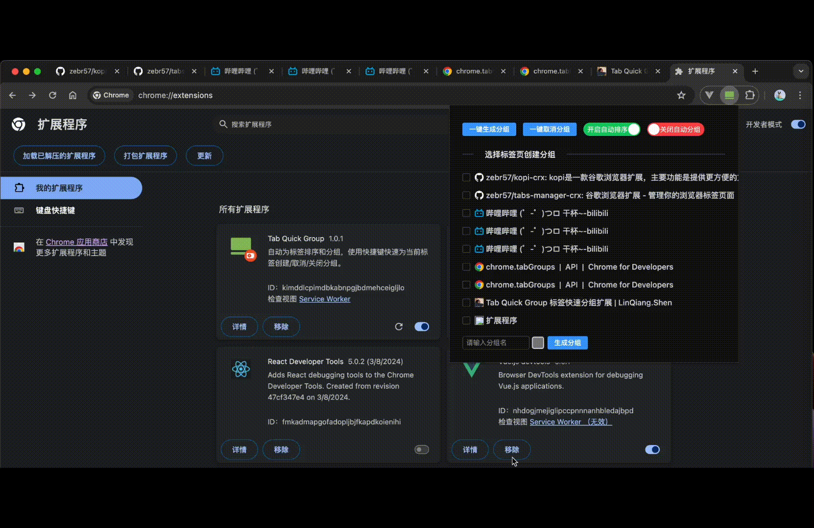
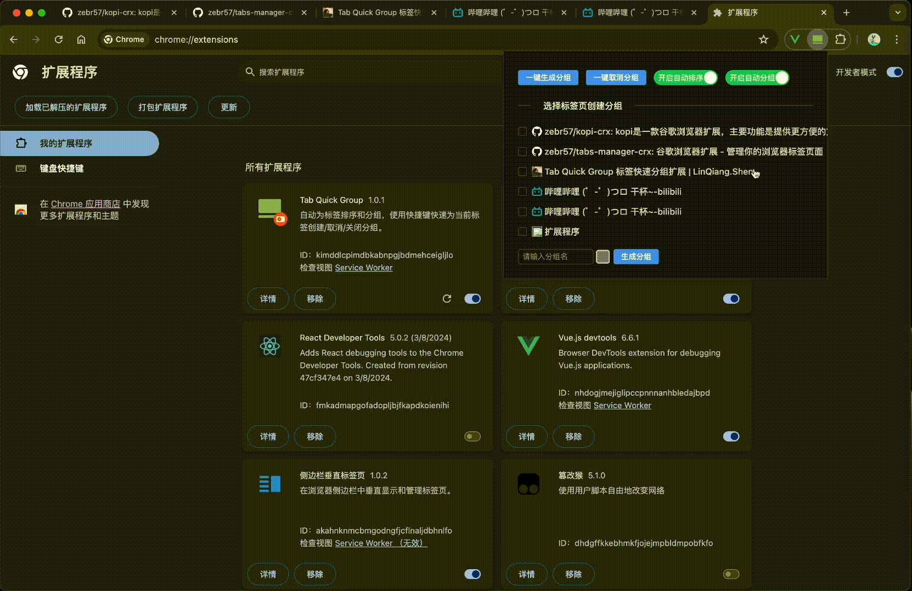
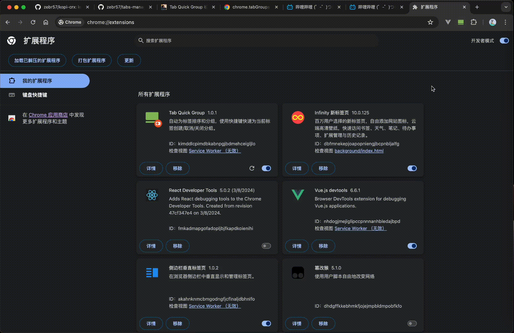
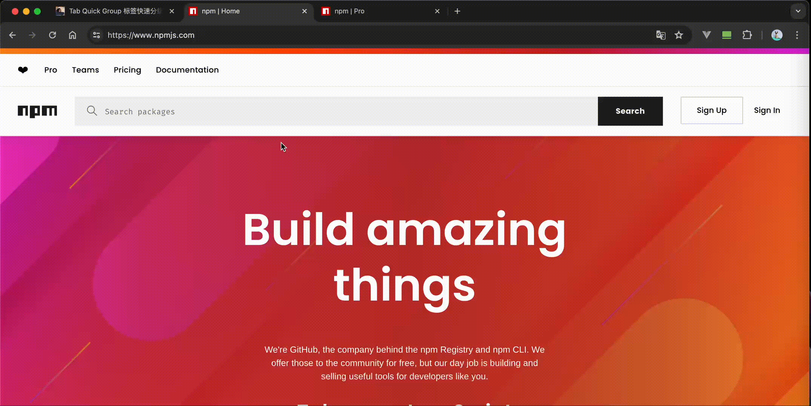
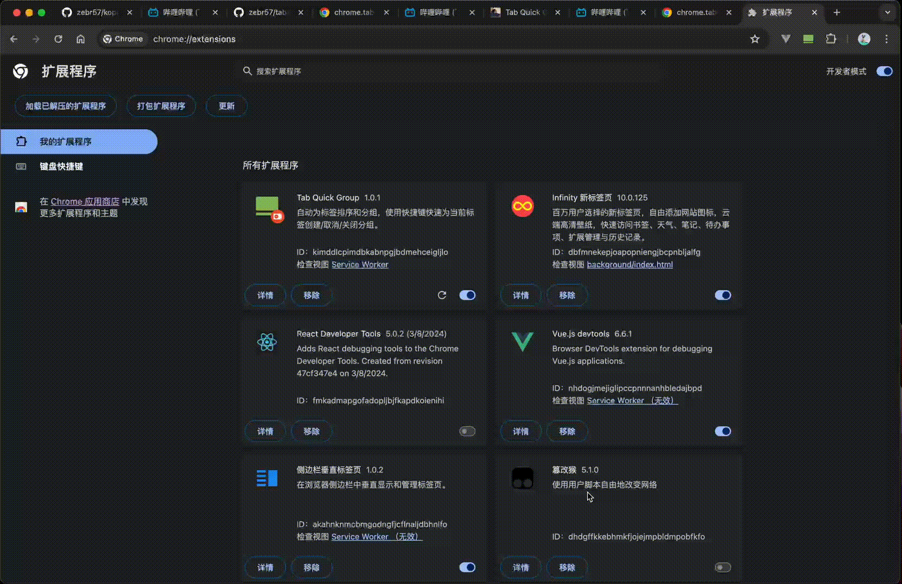

# Tab Quick Group 标签快速分组扩展

## 概览

基于 chrome extension API 实现的 chrome 标签页分组管理扩展，让你的标签栏排序整洁、方便查找。其主要功能有：

- 标签页自动排序/分组
- 一键自动生成/取消分组
- 勾选标签页进行命名分组
- 快速生成/取消同域名分组（`⌥+Q`）
- 快速关闭当前分组（`⌥+W`）
- 快速排序标签页（`⌥+S`）

系统快捷键：

- Window: `Alt`
- Mac: `⌥`

## 下载安装

[chrome 应用商店](https://chromewebstore.google.com/detail/jcdjkkkngigioljkkbbbmnegegamhcjp/privacy)
[github](https://github.com/zebr57/tabs-manager-crx/tree/master/dist)

## 效果演示

### 自动排序/分组

当我们打开新的 url 地址时，会检测是否存在多个相同域名的标签并进行排序/分组。

### 一键自动生成/取消分组、勾选标签页进行命名分组

当我们点击：`一键生成分组` 将所有标签页进行同域名分组，`一键取消分组` 将取消所有分组。

勾选标签页选项，输入分组名、选择颜色、点击`生成分组`，即可为选中的标签页生成一个分组。

### 快速生成/取消同域名分组（快捷键操作）

按 `⌥+Q` ，会自动检测当前标签页是否已分组，是则取消分组，否则将多个同域名标签生成分组。

### 快速关闭当前分组（快捷键操作）

按 `⌥+W` ，会自动检测当前标签页是否已加入分组，是则关闭分组，否则忽略操作。

### 快速排序标签页（快捷键操作）

按 `⌥+S` ，根据同域名排序标签，标签不再杂乱。

## 项目运行

- node v18.14.2
- 构建工具 vite + crxjs
- 包管理 yarn
- 执行 yarn build 生成 dist
- 打开浏览器扩展管理 chrome://extensions/
- 点击加载已解压的扩展程序
- 选择 dist 所在文件目录
